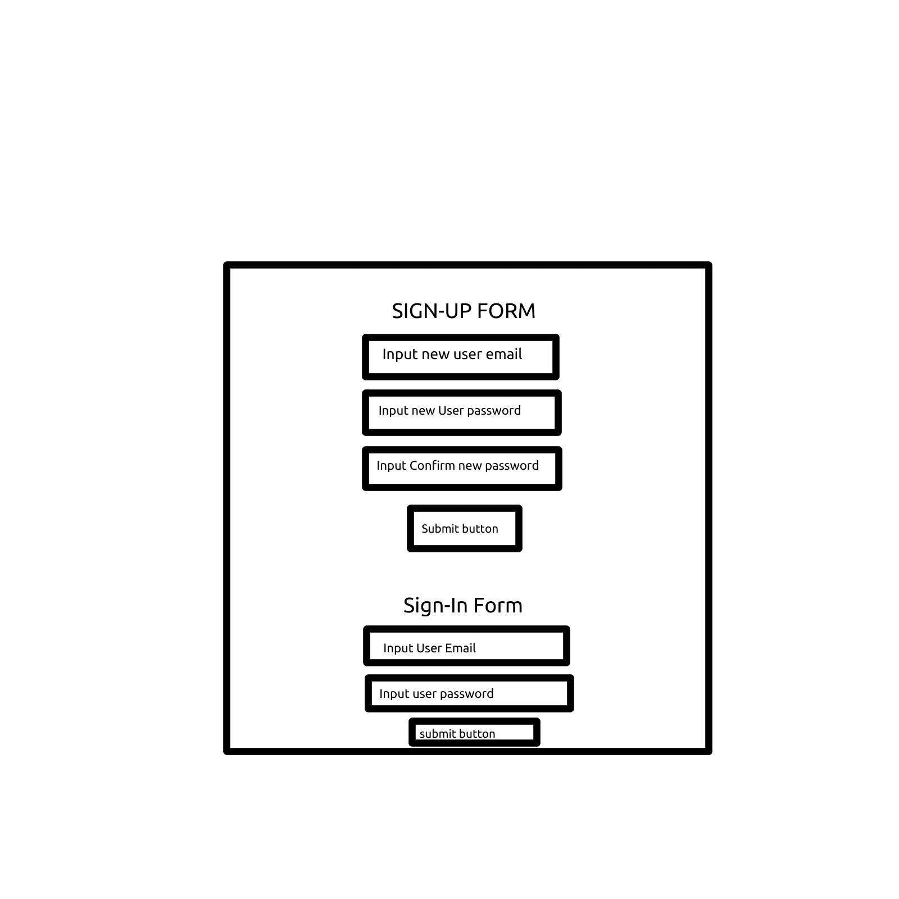
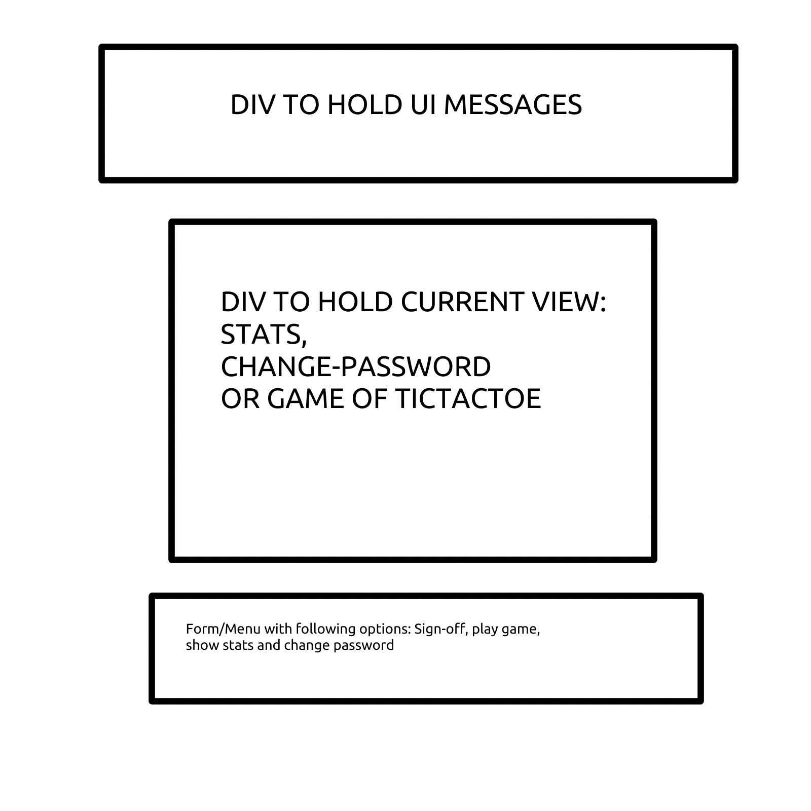

# Tic-Tac-Toe

## Planning Story ##
When I started planning, I jumped the gun and started making a wireframe for a single page with login,
tic-tac-toe board and new-game/rest & show-games played buttons. After reviewing what was expected
and what was capable. I instead made plans for two views; one view for signing up/in and one view
for the game itself with several subsets of the view based upon which button was clicked.
I then wrote down my user stories, organizing them by characteristic like so:

+ Online user for online capabilities
+ Gaming user for game features
+ Analytical user for statistic-based features

After writing down all the possible features required I created a plan organized by view/topic
and then further organized by feature which I used as a checklist. The end result
is the game I created.

## User Stories ##
- As an online user, I want to sign-up as an online user.
- As an online user, I want to sign-in using my online account's credentials
- As an online user, I want to be able to log out of my online account
- As a gaming user, I want to be able to create a new game or reset a game in the middle of play.
- As a gaming user, I want to be able to place pieces on the 'game-board' and see the results, while also having my online game data be updated.
- As a gaming user, I want some feature to show me whose turn it is.
- As a gaming user, I want the game to recognize when I've made an incorrect move and prevent updating the game and provide a proper error message.
- As a gaming user, I want the game to check for a winner each turn and if they found one, stop the game and provide an appropriate victory message.
- As an analytical user, I want a feature that will show me how many games I have played.
- As an analytical user, I  want the data subdivided further into several categories.

## Technologies used ##
+ jQuery
+ HTML/CSS
+ Bootstrap
+ Javascript

## Unsolved Problems ##

### Future modifications ###
+ I would like to add a series of AI for users to play against.
+ I would like to create as an add-on the ability for users to select whether they play as X-or-O
+ I would like to finish by creating a multiplayer feature.

## Wireframe(s) ##

### Sign-in/up wireframe ###

### Signed-in game wireframe ###

